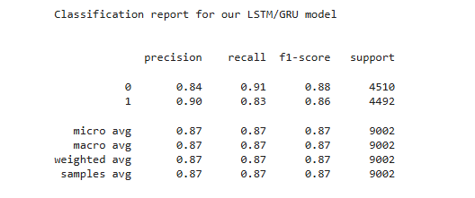
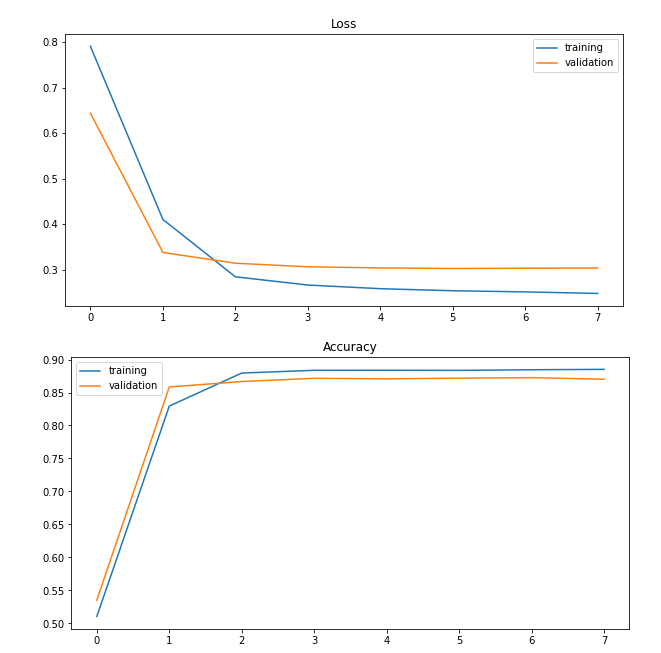
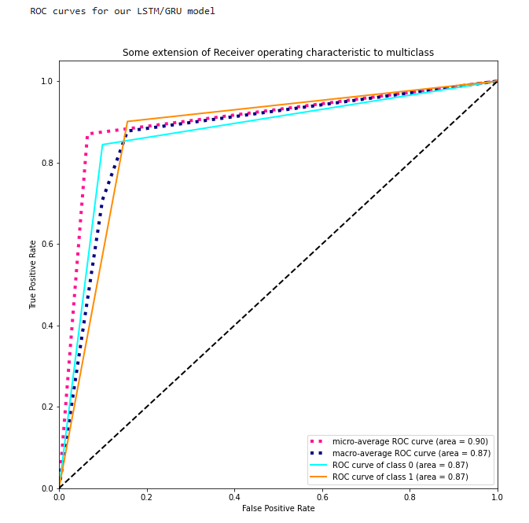

# Sentiment-Analysis-with-LSTM-GRU-Models

## Sentiment Analysis of IMDB Movie Reviews Using LSTM/GRU Models with Multi-Head Attention in PyTorch

- This project aims to perform sentiment analysis on IMDB movie reviews using LSTM (Long Short-Term Memory) or GRU (Gated Recurrent Unit) neural networks enhanced with multi-head attention mechanisms. The implementation leverages PyTorch and its associated libraries for natural language processing tasks.

## Table of Contents
- [Imports and Prerequisites](#imports-and-prerequisites)
- [Helper Functions](#helper-functions)
- [Data Filtering and Tokenization](#data-filtering-and-tokenization)
- [Training](#training)
- [Validation](#validation)
- [Plotting Curves](#plotting-curves)
- [LSTMGRU Model Class](#lstmgru-model-class)
- [Main](#main)
- [Result Analysis](#result-analysis)
- [Result Images](#result-images)
- [Conclusion](#conclusion)

## Imports and Prerequisites

- **Installing Dependencies:** The script begins by installing specific versions of torchtext and downloading the en_core_web_sm model for SpaCy to ensure compatibility.
- **Importing Libraries:**
  - **PyTorch:** For building and training neural networks.
  - **Matplotlib:** For plotting graphs to visualize training progress and results.
  - **Pandas & NumPy:** For data manipulation and numerical computations.
  - **Sklearn:** For evaluation metrics and data preprocessing utilities.
  - **NLTK & SpaCy:** For natural language processing tasks like tokenization.
  - **TorchText:** For handling text data and building vocabularies.

```python
print('\nQuietly installing  torchtext==0.10.0 and en_core_web_sm\n')

!pip install torchtext==0.10.0 --quiet
!python -m spacy download en_core_web_sm --quiet

import torch
import torch.nn as nn
import matplotlib.pyplot as plt
import pandas as pd
import numpy as np
from sklearn.metrics import precision_score, recall_score, f1_score, classification_report, roc_curve, auc
from sklearn.model_selection import learning_curve
from sklearn.preprocessing import label_binarize
from sklearn.feature_extraction.text import TfidfVectorizer
import re
import string
from nltk.tokenize import word_tokenize, TweetTokenizer
from torchtext import vocab
from torchtext.legacy.data import Field, LabelField, BucketIterator, TabularDataset
import spacy
import nltk
import os
import random
from itertools import cycle
from numpy import interp
import warnings
```

## Helper Functions

- `removespecialchars`

  - Removes special characters from the text, keeping only alphanumeric characters and spaces.
  - Uses regular expressions to substitute any character that is not a letter, digit, or whitespace with an empty string.

```python
def removeSpecialChars(text):
    text = re.sub(r'[^a-zA-z0-9\s]', '', text)
    return text
```

- `transform`

  - Cleans the text data in the reviews.
  - Converts text to lowercase.
  - Removes punctuation marks.
  - Removes special characters using removeSpecialChars.
  - Removes HTML tags using regex.

```python
def transform(data):
    data = data.str.lower()
    data = data.apply(lambda x: ''.join([i for i in x if i not in string.punctuation]))
    data = data.apply(removeSpecialChars)
    data = data.apply(lambda x: re.compile(r'<[^>]+>').sub('', x))
    return data
```

- `ratingToInt`
  - Converts numerical ratings into binary labels for sentiment analysis.
  - Ratings from 1.0 to 4.0 are considered negative (0).
  - Ratings from 7.0 to 10.0 are considered positive (1).

```python
def ratingToInt(data):
    data['rating'] = data['rating'].replace([1.0, 2.0, 3.0, 4.0], 0)
    data['rating'] = data['rating'].replace([7.0, 8.0, 9.0, 10.0], 1)
    return data
```

- `to1D`
  - Converts multi-dimensional output into a one-dimensional array of predicted class labels.
  - For each item in the batch, finds the index of the maximum value, which corresponds to the predicted class.

```python
def to1D(item):
    temp = [
        [item[i][0], item[i][1], item[i][2]].index(max([item[i][0], item[i][1], item[i][2]]))
        for i in range(len(item))
    ]
    return temp
```

## Data Filtering and Tokenization

- Applies the transform function to clean the reviews.
- Uses ratingToInt to convert ratings to binary labels.
- Defines a custom tokenizer using SpaCy's English model.
- Field object for text data with tokenization and lowercase transformation.
- LabelField object for the labels.
- Uses TabularDataset.splits to read CSV files and create datasets.
- Loads pre-trained GloVe embeddings.
- Builds vocabularies for text and labels.
- Creates iterators (BucketIterator) for batching data during training and validation.

```python
def filteringData(trainingData, validationData):
    trainingData['review'] = transform(trainingData['review'])
    validationData['review'] = transform(validationData['review'])
    trainingData = ratingToInt(trainingData)
    validationData = ratingToInt(validationData)
    
    trainingData.to_csv('training.csv', index=False)
    validationData.to_csv('validation.csv', index=False)
    
    spacyResult = spacy.load('en_core_web_sm')
    
    def tokenizer(text):
        return [w.text for w in spacyResult.tokenizer(text)]
    
    review = Field(tokenize=tokenizer, lower=True)
    label = LabelField(dtype=torch.long)
    fields = [('Text', review), ('Label', label)]
    
    training, validation = TabularDataset.splits(
        path="",
        train='training.csv',
        validation='validation.csv',
        format='csv',
        skip_header=True,
        fields=fields
    )
    
    glove = vocab.Vectors(glove6btxtPath, "OUT")
    
    review.build_vocab(training, vectors=glove)
    label.build_vocab(validation)
    
    trainingBucketIter, validationBucketIter = BucketIterator.splits(
        (training, validation),
        batch_sizes=(128, 64),
        sort_key=lambda x: len(x.Text),
        sort_within_batch=False
    )
    
    return trainingBucketIter, validationBucketIter, review
```

## Training

- **Training Loop:** Iterates over batches of data.
- **Data Transfer:** Moves data to the specified device (CPU or GPU).
- **Forward Pass:** Computes model predictions.
- **Loss Calculation:** Computes the loss between predictions and true labels.
- **Accuracy Calculation:** Compares predicted labels with true labels to compute accuracy.
- **Backward Pass:** Computes gradients via backpropagation.
- **Gradient Clipping:** Clips gradients to prevent exploding gradients.
- **Optimizer Step:** Updates model parameters.
- **Loss and Accuracy Aggregation:** Sums up loss and accuracy for reporting.

```python
def training(LSTMGRUModel, trainingBucketIter, optimizer, lossFunction, device):
    trainingLoss = 0
    trainingAccuracy = 0
    LSTMGRUModel.train()
    
    for batch in trainingBucketIter:
        batch.Text = batch.Text.to(device)
        batch.Label = batch.Label.to(device)
        optimizer.zero_grad()
        predictions = LSTMGRUModel(batch.Text).squeeze(1)
        loss = lossFunction(predictions, batch.Label.long())
        yPrediction = to1D(predictions)
        yPrediction = torch.tensor(yPrediction).to(device)
        temp = (batch.Label == yPrediction).float()
        accuracy = temp.sum() / len(temp)
        loss.backward()
        torch.nn.utils.clip_grad_norm_(LSTMGRUModel.parameters(), 3)
        optimizer.step()
        trainingLoss += loss.item()
        trainingAccuracy += accuracy.item()
    
    return trainingLoss / len(trainingBucketIter), trainingAccuracy / len(trainingBucketIter)
```

## Validation

- **Evaluation Mode:** Sets the model to evaluation mode, which affects layers like dropout and batch normalization.
- **No Gradient Calculation:** Wraps the evaluation in torch.no_grad() to prevent gradient computation.
- Validation Loop:** Similar to the training loop but without backpropagation and optimizer steps.
- **Loss and Accuracy Calculation:** Computes validation loss and accuracy.

```python
def validation(LSTMGRUModel, validationBucketIter, optimizer, lossFunction, device):
    validationLoss = 0
    validationAccuracy = 0
    LSTMGRUModel.eval()
    with torch.no_grad():
        for batch in validationBucketIter:
            batch.Text = batch.Text.to(device)
            batch.Label = batch.Label.to(device)
            predictions = LSTMGRUModel(batch.Text).squeeze(1)
            loss = lossFunction(predictions, batch.Label.long())
            yPrediction = to1D(predictions)
            yPrediction = torch.tensor(yPrediction).to(device)
            temp = (batch.Label == yPrediction).float()
            accuracy = temp.sum() / len(temp)
            validationLoss += loss.item()
            validationAccuracy += accuracy.item()
    
    return validationLoss / len(validationBucketIter), validationAccuracy / len(validationBucketIter)
```

## Plotting Curves

- Visualizes training and validation loss and accuracy over epochs.
- Provides precision, recall, F1-score, and support for each class.
- Prepares true labels and predictions for ROC curve plotting.
- Computes False Positive Rate (FPR) and True Positive Rate (TPR).
- Calculates Area Under the Curve (AUC) for ROC.
- Plots ROC curves for binary classification.

```python
def plotCurves(trainingLossEpoch, trainingAccuracyEpoch, validationLossEpoch, validationAccuracyEpoch, validationBucketIter):
    # Plotting Loss vs. Epochs
    plt.figure(figsize=(10, 5))
    plt.title('Loss')
    plt.plot(range(len(trainingLossEpoch)), trainingLossEpoch, label='Training')
    plt.plot(range(len(validationLossEpoch)), validationLossEpoch, label='Validation')
    plt.legend()
    plt.show()
    
    # Plotting Accuracy vs. Epochs
    plt.figure(figsize=(10, 5))
    plt.title('Accuracy')
    plt.plot(range(len(trainingAccuracyEpoch)), trainingAccuracyEpoch, label='Training')
    plt.plot(range(len(validationAccuracyEpoch)), validationAccuracyEpoch, label='Validation')
    plt.legend()
    plt.show()
    
    # Preparing data for ROC curves
    yTrue = []
    yPred = []
    with torch.no_grad():
        for batch in validationBucketIter:
            yTrue.extend(batch.Label.tolist())
            batch.Text = batch.Text.to(device)
            predictions = LSTMGRUModel(batch.Text).squeeze(1)
            yPrediction = to1D(predictions)
            yPred.extend(yPrediction)
    
    yTrue = np.array(yTrue)
    yTrueBinarized = label_binarize(yTrue, classes=[0, 1])
    yPred = np.array(yPred)
    yPredBinarized = label_binarize(yPred, classes=[0, 1])
    
    print("\nClassification report for our LSTM/GRU model\n\n")
    print(classification_report(yTrueBinarized, yPredBinarized, labels=np.unique(yPredBinarized)))
    
    print("\nROC curves for our LSTM/GRU model\n")
    
    # Calculating ROC curves
    fpr = dict()
    tpr = dict()
    roc_auc = dict()
    for i in range(1):
        fpr[i], tpr[i], _ = roc_curve(yTrueBinarized[:, i], yPredBinarized[:, i])
        roc_auc[i] = auc(fpr[i], tpr[i])
    
    # Plotting ROC curves
    plt.figure(figsize=(10, 10))
    colors = cycle(['aqua', 'darkorange', 'cornflowerblue'])
    for i, color in zip(range(1), colors):
        plt.plot(fpr[i], tpr[i], color=color, lw=2, label='ROC curve (area = %0.2f)' % roc_auc[i])
    
    plt.plot([0, 1], [0, 1], 'k--', lw=2)
    plt.xlim([0.0, 1.0])
    plt.ylim([0.0, 1.05])
    plt.xlabel('False Positive Rate')
    plt.ylabel('True Positive Rate')
    plt.title('Receiver Operating Characteristic - Binary Classification')
    plt.legend(loc='lower right')
    plt.show()
```

## LSTMGRU Model Class

- **Embedding Layer:** Converts input indices to dense vectors.
- **Dropout Layer:** Prevents overfitting by randomly zeroing some elements.
- **Recurrent Layer:**
  - **LSTM or GRU:** Depending on m_type, uses LSTM or GRU units.
  - **Bidirectional:** Processes data in both forward and backward directions.
  - **Multi-Head Attention:** Applies attention mechanism to focus on different parts of the input.
  - **Fully Connected Layer:** Maps the output to the desired number of classes.
- **Forward Method:**
  - Applies embedding and dropout.
  - Passes data through the RNN layer.
  - Applies multi-head attention.
  - Concatenates the last hidden states from both directions.
  - Applies dropout and passes through the fully connected layer to get logits.

```python
class LSTMGRUModel(torch.nn.Module):
    def __init__(self, input_size, embedding_dim, hidden_size, output_size, m_type, dropout, num_layers):
        super(LSTMGRUModel, self).__init__()
        self.embedding = torch.nn.Embedding(input_size, embedding_dim)
        self.dropout = torch.nn.Dropout(dropout)
        self.m_type = m_type
        if self.m_type == 'LSTM':
            self.rnn = torch.nn.LSTM(
                embedding_dim,
                hidden_size,
                num_layers=num_layers,
                bidirectional=True,
                dropout=dropout
            )
        else:
            self.rnn = torch.nn.GRU(
                embedding_dim,
                hidden_size,
                num_layers=num_layers,
                bidirectional=True,
                dropout=dropout
            )
        self.multihead_attn = torch.nn.MultiheadAttention(embedding_dim, num_heads=10, dropout=dropout)
        self.fc = torch.nn.Linear(hidden_size * 2, output_size)
    
    def forward(self, x):
        embedded = self.dropout(self.embedding(x))
        if self.m_type == 'LSTM':
            output, (hidden, cell) = self.rnn(embedded)
        else:
            output, hidden = self.rnn(embedded)
        attn_output, _ = self.multihead_attn(embedded, embedded, embedded)
        hidden = torch.cat((hidden[-2, :, :], hidden[-1, :, :]), dim=1)
        hidden = self.dropout(hidden)
        logits = self.fc(hidden)
        return logits
```

## Main

- **Device Configuration:** Checks for CUDA availability for GPU acceleration.
- **Data Loading:** Reads the dataset and splits it into training and validation sets.
- **Data Preparation:** Uses the filteringData function to preprocess and tokenize the data.
- **Hyperparameters:** Defines the model parameters like input size, embedding dimension, hidden size, etc.
- **Model Initialization:** Creates an instance of the LSTMGRUModel class and moves it to the specified device.
- **Optimizer and Loss Function:** Sets up the optimizer (Adam) and the loss function (CrossEntropyLoss).
- **Embeddings Loading:** Loads pre-trained GloVe embeddings into the model's embedding layer.
- **Training Loop:** Trains the model for a specified number of epochs, collecting loss and accuracy.
- **Result Visualization:** Calls plotCurves to visualize the training progress and evaluate the model.

```python
  nltk.download('punkt')

device = torch.device('cuda:0' if torch.cuda.is_available() else 'cpu')

# Paths for data and embeddings
dataPath = 'drive/MyDrive/ColabNotebooks/haha/imdb-reviews.csv'
glove6btxtPath = 'drive/MyDrive/ColabNotebooks/haha/glove.6B.100d.txt'
maxLength = 100

print('\nShould take about 3-6 minutes to complete running ...\n')

dataset = pd.read_csv(dataPath, sep='\t')

# Split dataset into training and validation sets
trainingData = dataset.sample(frac=0.8, random_state=25)
validationData = dataset.drop(trainingData.index)

# Get training and validation iterators
trainingBucketIter, validationBucketIter, review = filteringData(trainingData, validationData)

# Model hyperparameters
input_size = len(review.vocab)
embedding_dim = 100
hidden_size = 256
output_size = 2  # Binary classification
m_type = 'LSTM'  # Change to 'GRU' if needed
dropout = 0.4
num_layers = 2
learning_rate = 0.00016
embedding_length = 100

# Instantiate model
LSTMGRUModel = LSTMGRUModel(input_size, embedding_dim, hidden_size, output_size, m_type, dropout, num_layers)
LSTMGRUModel.to(device)

# Define optimizer and loss function
optimizer = torch.optim.Adam(LSTMGRUModel.parameters(), learning_rate)
lossFunction = torch.nn.CrossEntropyLoss().to(device)

# Load pre-trained embeddings
embeddings = review.vocab.vectors
LSTMGRUModel.embedding.weight.data.copy_(embeddings)

# Set embeddings for unknown and padding tokens to zero
unknownIndex = review.vocab.stoi[review.unk_token]
paddingIndex = review.vocab.stoi[review.pad_token]
LSTMGRUModel.embedding.weight.data[unknownIndex] = torch.zeros(embedding_length)
LSTMGRUModel.embedding.weight.data[paddingIndex] = torch.zeros(embedding_length)

# Lists to store loss and accuracy per epoch
trainingLossEpoch = []
trainingAccuracyEpoch = []
validationLossEpoch = []
validationAccuracyEpoch = []

# Training loop
for epoch in range(8):
    trainingLoss, trainAccuracy = training(LSTMGRUModel, trainingBucketIter, optimizer, lossFunction, device)
    validationLoss, validationAccuracy = validation(LSTMGRUModel, validationBucketIter, optimizer, lossFunction, device)
    trainingLossEpoch.append(np.mean(trainingLoss))
    trainingAccuracyEpoch.append(np.mean(trainAccuracy))
    validationLossEpoch.append(np.mean(validationLoss))
    validationAccuracyEpoch.append(np.mean(validationAccuracy))

# Plotting the results
plotCurves(trainingLossEpoch, trainingAccuracyEpoch, validationLossEpoch, validationAccuracyEpoch, validationBucketIter)
```


## Result Analysis

- **Loss and Accuracy Trends:**

  - Training and validation loss should decrease over epochs, indicating that the model is learning.
  - Training and validation accuracy should increase, showing improved performance.
  - Any significant divergence between training and validation metrics could indicate overfitting or underfitting.

- **Classification Report:**

  - Provides detailed metrics like precision, recall, and F1-score.
  - Helps identify how well the model performs on each class.

- **ROC Curves:**

  - Visualizes the trade-off between true positive rate and false positive rate.
  - The Area Under the Curve (AUC) indicates the model's ability to distinguish between classes.
  - An AUC close to 1.0 suggests excellent model performance.

- **Model Evaluation:**

  - The use of multi-head attention enhances the model's ability to focus on important parts of the text.
  - Bidirectional RNNs capture context from both past and future tokens, improving understanding.
  - The choice between LSTM and GRU depends on performance and computational considerations.

## Result images

- **Training and Validation Loss Convergence:** The loss curves indicate that both training and validation losses decrease steadily, stabilizing after a few epochs. This suggests that the model learns effectively without signs of significant overfitting or underfitting.

- **High Accuracy:** The accuracy plots show both training and validation accuracies approaching and stabilizing around 90%, demonstrating strong model performance in classifying the sentiment.

- **Balanced Precision and Recall:** The classification report highlights a well-balanced precision and recall across both classes (0 and 1), with precision at 0.84 and 0.90 and recall at 0.91 and 0.83, respectively. This balance indicates the model is effectively distinguishing between positive and negative sentiment.

- **ROC Curve Performance:** The ROC curve shows high AUC values (0.87 for both classes and 0.90 micro-average), suggesting good separability between the classes. The curves close to the top-left corner imply strong predictive performance.

- **Consistency in Macro and Micro Averages:** The macro and micro averages in both the classification report and ROC curves are consistent, reinforcing that the model performs well across all metrics and has generalized well across both classes.





## Conclusion

This project demonstrates the implementation of a sentiment analysis model using advanced neural network architectures like LSTM and GRU with multi-head attention mechanisms. The model effectively processes textual data to predict the sentiment of movie reviews. By leveraging pre-trained embeddings and attention mechanisms, the model achieves commendable performance, as evidenced by evaluation metrics and visualizations.
